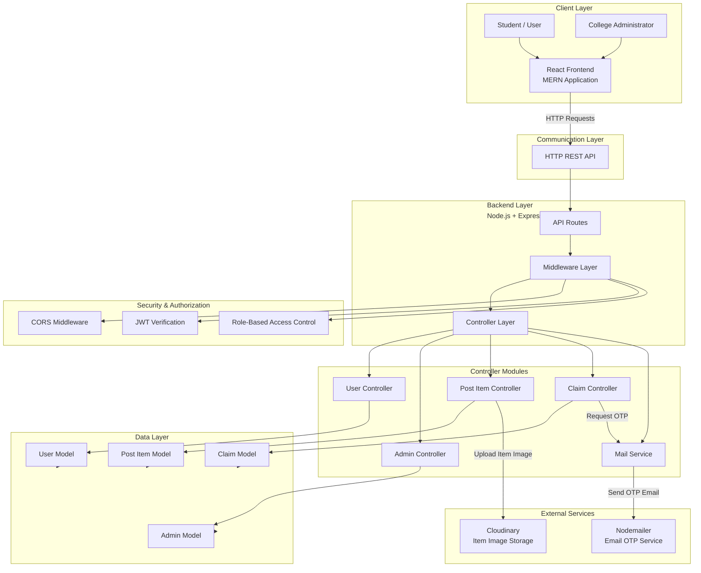
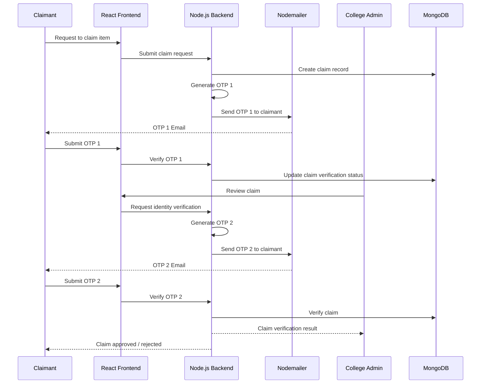
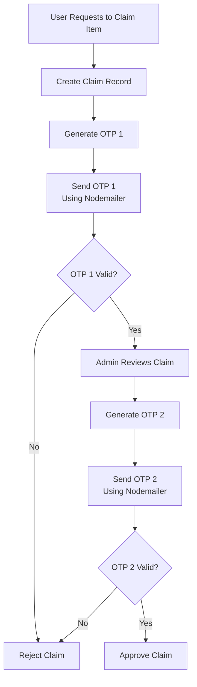
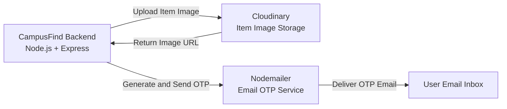

# CampusFind

CampusFind is a web-based Lost and Found Management System designed specifically for college campuses.

The platform enables students to report lost or found items, search for reported items, and initiate secure ownership claims. To prevent fraudulent claims, the system uses a two-step OTP-based identity verification process involving both the claimant and the college administrator.

---

## Problem Statement

Traditional lost-and-found systems often rely on manual announcements, notice boards, or informal communication channels. These approaches make it difficult to:

- Track lost and found items
- Search through existing reports
- Verify the actual owner of an item
- Prevent fraudulent ownership claims
- Maintain a centralized record of reported items

CampusFind provides a centralized digital platform for managing lost and found items within a college campus.

---

## Key Features

### 🔍 Lost and Found Item Management

- Report lost items
- Report found items
- Upload item images
- Search and browse reported items
- View item details
- Filter available posts

### 👤 User Management

- User registration and authentication
- JWT-based authentication
- Role-Based Access Control (RBAC)
- Secure user profile management

### 🔐 Secure Claim Verification

CampusFind uses a two-step OTP verification system to validate ownership claims.

1. The claimant requests to claim an item.
2. The website generates and sends an OTP to the claimant.
3. The college administrator initiates the verification process.
4. The administrator generates a second OTP.
5. Both OTPs are verified before the claim is approved.

This reduces the possibility of fraudulent claims.

### 👨‍💼 Admin Management

- Review item claims
- Verify claimant identity
- Generate verification OTP
- Approve or reject claims
- Manage reported items

### 📧 Email OTP Verification

Nodemailer is used to send OTPs through email for:

- Identity verification
- Ownership claim verification
- Secure user operations

### ☁️ Image Upload

Cloudinary is used for:

- Uploading lost item images
- Uploading found item images
- Storing and serving image URLs

---

#  System Architecture

CampusFind follows a layered client-server architecture.

The React frontend communicates with the Node.js and Express.js backend through REST APIs. Requests pass through middleware for CORS handling, JWT verification, and role-based authorization before reaching the appropriate controllers.

The controllers handle business logic and communicate with MongoDB models and external services such as Nodemailer and Cloudinary.



---

# 🔐 Authentication and Authorization

CampusFind uses JWT-based authentication and Role-Based Access Control.

```text
User
  ↓
Login / Register
  ↓
Backend validates credentials
  ↓
JWT token generated
  ↓
Token sent to client
  ↓
Client sends token with future requests
  ↓
JWT Middleware verifies token
  ↓
RBAC Middleware verifies user role
  ↓
Authorized Controller executes request
```


---

# 🔑 Two-Step Claim Verification

The core security feature of CampusFind is the dual OTP verification mechanism.

A claim is not approved using only a single OTP.

The system verifies the identity through two independent OTPs:

- **OTP 1:** Generated when the user initiates the claim request.
- **OTP 2:** Generated by the college administrator during identity verification.

Both OTPs must be successfully verified before the claim can be approved.



---

# 🧩 Claim Verification Flow



---

# 📂 Project Architecture

The backend follows a modular architecture separating routes, middleware, controllers, models, and services.

```text
CampusFind/
│
├── frontend/
│   │
│   ├── src/
│   │   ├── components/
│   │   ├── pages/
│   │   ├── hooks/
│   │   ├── context/
│   │   ├── services/
│   │   └── App.jsx
│   │
│   └── package.json
│
├── backend/
│   │
│   ├── controllers/
│   │   ├── user.controller.js
│   │   ├── admin.controller.js
│   │   ├── post.controller.js
│   │   ├── claim.controller.js
│   │   └── mail.controller.js
│   │
│   ├── models/
│   │   ├── User.js
│   │   ├── Post.js
│   │   ├── Claim.js
│   │   └── Admin.js
│   │
│   ├── routes/
│   │   ├── user.routes.js
│   │   ├── admin.routes.js
│   │   ├── post.routes.js
│   │   └── claim.routes.js
│   │
│   ├── middleware/
│   │   ├── auth.middleware.js
│   │   ├── role.middleware.js
│   │   └── cors.middleware.js
│   │
│   ├── services/
│   │   ├── mail.service.js
│   │   └── cloudinary.service.js
│   │
│   └── server.js
│
└── README.md
```

> Modify this folder structure to match the actual project files.

---

# 🗃️ Database Models

| Model | Responsibility |
|---|---|
| User | Stores user profile and authentication data |
| Post | Stores lost and found item information |
| Claim | Stores item ownership claim and verification status |
| Admin | Stores administrator-related data and permissions |

---


---

# ☁️ External Service Integration



---

# 🛠️ Technology Stack

## Frontend

- React
- JavaScript
- Tailwind CSS
- React Router

## Backend

- Node.js
- Express.js
- REST APIs

## Database

- MongoDB
- Mongoose

## Authentication & Security

- JSON Web Tokens (JWT)
- Role-Based Access Control (RBAC)
- CORS Middleware

## External Services

- Nodemailer
- Cloudinary

## Development Tools

- Git
- GitHub
- VS Code

---

# ⚙️ Installation and Setup

## Clone the Repository

```bash
git clone <your-repository-url>
cd CampusFind
```

## Install Frontend Dependencies

```bash
cd frontend
npm install
```

## Install Backend Dependencies

```bash
cd ../backend
npm install
```

## Configure Environment Variables

Create a `.env` file in the backend directory:

```env
PORT=5000

MONGO_URI=your_mongodb_connection_string

JWT_SECRET=your_jwt_secret

EMAIL_USER=your_email
EMAIL_PASSWORD=your_email_password

CLOUDINARY_CLOUD_NAME=your_cloudinary_cloud_name
CLOUDINARY_API_KEY=your_cloudinary_api_key
CLOUDINARY_API_SECRET=your_cloudinary_api_secret
```


---

# ▶️ Run the Application

## Start Backend

```bash
cd backend
npm run dev
```

## Start Frontend

```bash
cd frontend
npm run dev
```

---

# 🔮 Future Improvements

- Push notifications
- Mobile application
- AI-based item similarity matching
- Image-based item search
- Advanced admin analytics
- Automated duplicate item detection
- Email notification history
